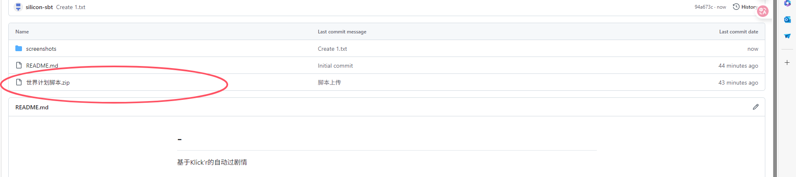
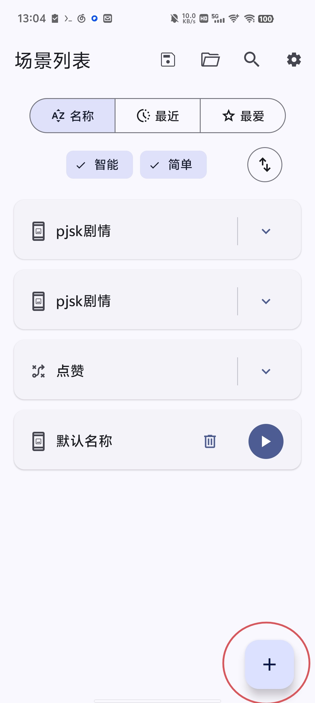

# -
基于Klick'r的自动过世界计划主线剧情

这个脚本完成于2025.12.28

首先，非常感谢Klick'r，以下是klick'r的仓库:

https://github.com/Nain57/Smart-AutoClicker/tree/3.3.4

使用方法：

第一步，打开klick'r的仓库，下载klick'r

第二步，去下载我里面的zip文件（你全下下来我也拦不住你）

第三步，将压缩包直接导入klick'r（对，你没看错，直接导入）

第三步，录制屏幕后，进入游戏，选择你没做到的剧情，进入后开启脚本

注意事项：

1，这个脚本无法检测你做到哪了，所以最好是那种没动过剧情的人用（主要是我技术不行）

2，这个脚本偶尔会漏剧情，做完记得检查一下

那个能给我点星标嘛

打赏（搞上吧，虽然我觉得应该没人会打赏）

